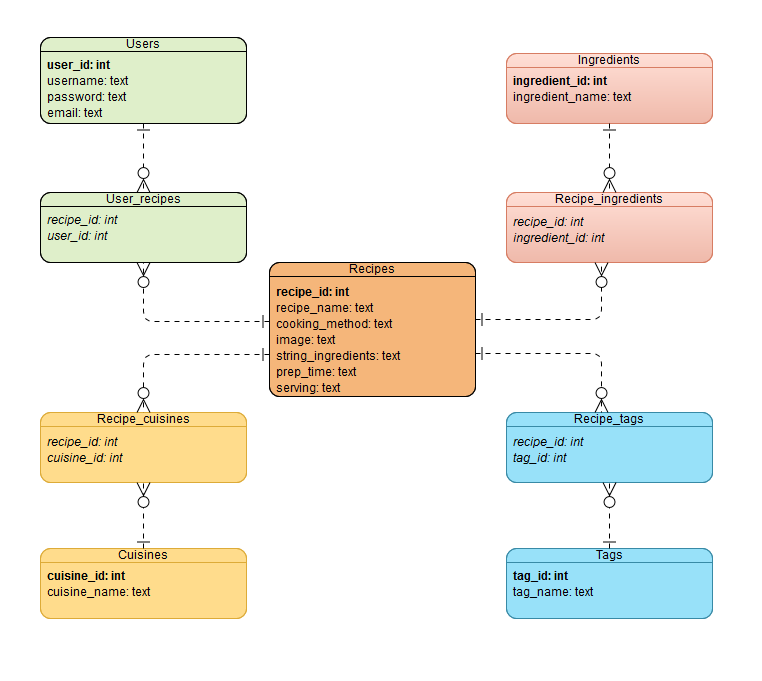

## Creating the database:
```
$ python create_database.py
$ python populate_database.py
```
This will create a *cuisinedom.sqlite* database file in the current working directory. Within *populate_database.py* you can modify the data inserted into the database.
Alternatively, the preimplemented database can be extracted from *cuisinedom.zip*. **Do not overwrite this**

## Database structure:

