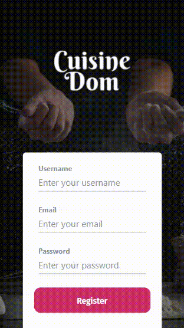

## Running the mock api to test the workflow:
```
$ pip install pipenv
$ cd frontend/mock_api
$ pipenv shell 
$ pipenv install flask 
$ set FLASK_ENV=development 
$ set FLASK_APP=cuisinedom 
$ flask init-db
$ flask fill-db
$ flask run  
```
## Running the frontend code after installing expo:
```
$ cd frontend/
$ expo start
```

## Installs
```
$ npm i @react-native-community/async-storage
$ npm install react-file-base64
$ npm install react-sticky-el
```

## Workflows
### 1. Enter Ingredients Workflow
<br>


<br>

### 2. Search Workflow
<br>


### 3.1 Register Workflow
<br>



### 3.2 Login Workflow
<br>


### 4 Profile Workflow
<br>


